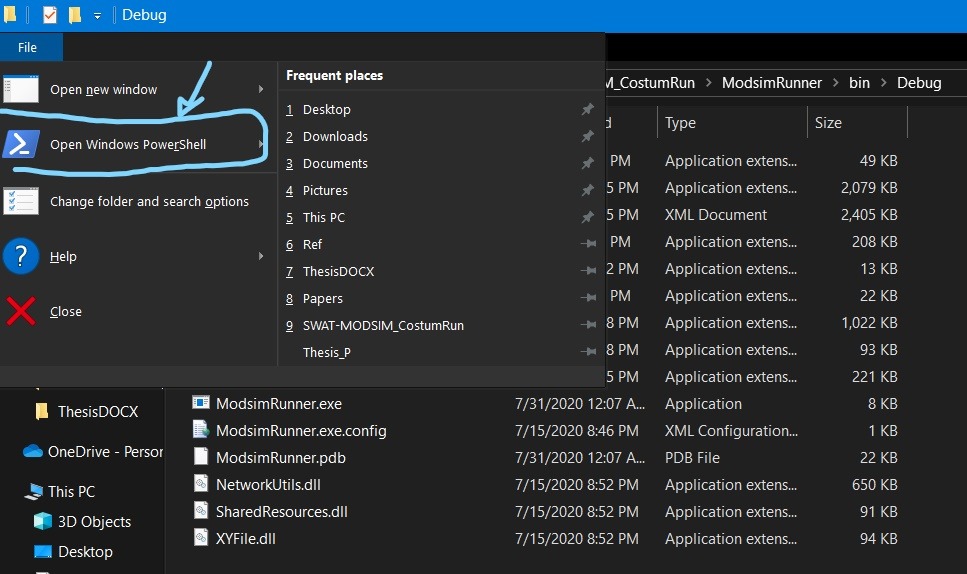
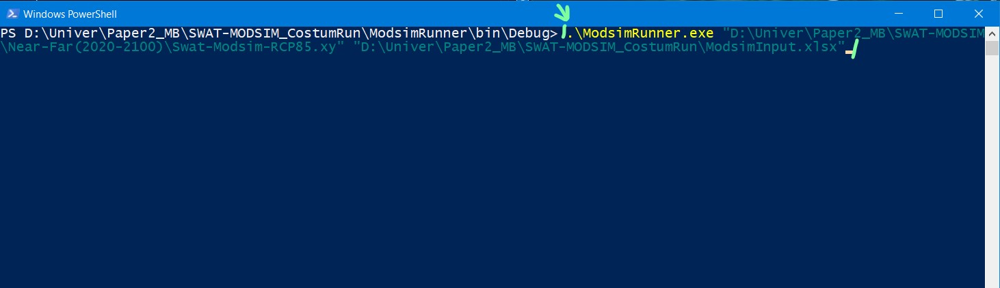

# MODSIM_CustomRun
This code is customized to changing demand nodes' time series for different scenarios with an excel file (.xlsx) in MODSIM 8.5.1 app and gives you an output file in the .xlsx type. In addition, for some insight, you can visit the example input file in the Examples folder. The sample output has been added, too. 

#### **Warning:** 
In order to add your desired nodes you should write the exact name of nodes in the header (first row) of your input excel file. 

#### **Tips:** 
The input excel file can contain different data for each scenario in separate sheets and the output excel file will be created based upon that order.

#### EASY WAY:
If you wish to run the code without changing it you can simply do the instruction below:

##### Step 1: 
Run PowerShell from file ribbon on File Explorer 

##### Step 2: 
In PowerShell type:
  .\ModsimRunner.exe ".xy file Pass" " .xlsx pass"

##### Step 3: 
Then simply press Enter to Run :)

